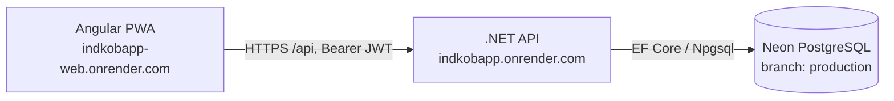
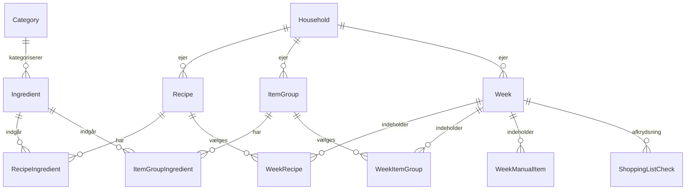

# Madplan & Indkøb — arkitektur (agent-reference)

> Teknisk reference for **den nuværende, kørende app** (`apps/meal-shopping/`). Formålet er, at en
> agent kan arbejde i koden uden at gætte. Kør-/deploy-trin står i [`README.md`](README.md) og
> [`DEPLOY.md`](DEPLOY.md); helheden i [`../../docs/ECOSYSTEM.md`](../../docs/ECOSYSTEM.md).

## 1. Hvad appen gør
Én husstand vælger ugens **retter** (og "varegrupper" som fx Frokost/Toilet). Appen genererer **én
samlet indkøbsliste** hvor ens ingredienser lægges sammen, enheder konverteres (g↔kg, ml↔l),
listen sorteres efter butikskategori, og hver linje kan krydses af. Flere husstande er isolerede.

Derudover (bygget som afgrænsede moduler i samme app — se §10):
- **Inspiration:** et fælles opskrifts-katalog man kan bladre i; "Tilføj" kopierer opskriften til
  husstandens egne og lægger den evt. direkte på en uge.
- **Køkkenlager (pantry):** husstandens "hvad har vi hjemme"; indkøbslisten viser kun det der
  mangler (behov minus lager) med "har X hjemme"-badges.
- **Deling:** ugens indkøbsliste kan deles via et token-link (`/del/<token>`) uden login —
  modtageren kan se og krydse af, synkront med husstanden.
- **Hjem (husstandens opgaver):** engangs-to-dos + gentagne pligter/vedligehold i én motor
  (`HouseholdTask`): interval ruller forfaldsdato frem ved "gjort", valgfri tur-rotation
  (komma-separerede navne), badge i navigationen med forfaldne + åbne.
- **Ordrer (butiks-demo):** husstanden sender ugens indkøbsliste som en `Order` til en butik;
  butikken (via `/butik`, adgang med butiks-nøgle — ikke husstands-login) pakker linjerne og
  markerer klar (`Modtaget → Pakkes → Klar → Afhentet`); husstanden ser status under "Mine ordrer".
  DEMO til at vise et supermarked konceptet — modnes senere til `apps/supermarket`. Se `../../docs/COMMERCIAL.md`.

## 2. Teknologi & topologi
- **Frontend:** Angular 20 (standalone components, signals), PWA. Hostes som **Render Static Site**
  → `indkobapp-web.onrender.com`. Bygges fra branch `main`, root `apps/meal-shopping/frontend/indkobs-app`,
  build `npm ci && npm run build`, publish `dist/indkobs-app/browser`, SPA-rewrite `/* → /index.html`.
- **Backend:** ASP.NET Core 10 Web API (C#), Docker. Hostes som **Render Web Service**
  → `indkobapp.onrender.com`. Bygges fra branch `cloud-deploy`, Docker-context `apps/meal-shopping`, `apps/meal-shopping/Dockerfile`.
- **Database:** PostgreSQL på **Neon** (branch `production`), EF Core 10 (Npgsql), code-first migrations.
- **Auth:** JWT (Bearer), login pr. husstand.



- Frontend finder backend via `environment.prod.ts` → `apiBase = https://indkobapp.onrender.com/api`.
  Lokalt (tom apiBase) bruges `location.hostname:5298` (se `frontend/.../src/app/api.ts`).

## 3. Placering i monorepoet
Denne app ligger under `apps/meal-shopping/` i repoet `PeterRebsdorfAU/IndkobApp` (public).
```
apps/meal-shopping/
├─ backend/IndkobsApp.Api/     # .NET API
│  ├─ Models/                  # entiteter + Unit-enum + UnitMath (enhedsmatematik)
│  ├─ Data/                    # AppDbContext, DbSeeder, Migrations/
│  ├─ Dtos/ Services/ Controllers/
│  └─ Program.cs               # DI, JWT, CORS, auto-migrate + seed
├─ frontend/indkobs-app/       # Angular PWA (pages/, shared/, auth*.ts, api.ts, models.ts)
├─ tools/DataMigrator/         # engangs-CLI: in-place skema-opgradering + opret husstand (bevarer data)
├─ Dockerfile                  # backend-image (context = apps/meal-shopping)
└─ README.md  ARCHITECTURE.md  DEPLOY.md
```
Fælles økosystem-ting ligger i repo-roden: `docs/ECOSYSTEM.md`, `shared/`, `render.yaml`.

**Branches:** `main` (frontend deployer herfra) og `cloud-deploy` (backend deployer herfra; primær arbejdsbranch).
Hold dem i sync ved at merge `cloud-deploy → main`.

## 4. Datamodel



- **Husstands-scoping:** `Recipe`, `ItemGroup`, `Week` har `HouseholdId` (cascade-delete fra `Household`).
  `Ingredient` og `Category` er OGSÅ **private pr. husstand** (fra jul 2026 — hver husstand har sin egen
  varebank og butiksrækkefølge; FK er Restrict, så husstands-sletning rydder eksplicit op i AdminController).
  Nye husstande får automatisk et standard-kategorisæt (`DbSeeder.SeedDefaultCategories`).
- **`Ingredient`** normaliseres: `NormalizedName` = trimmet + lowercased, med unikt indeks pr.
  `(HouseholdId, NormalizedName)` → ingen dubletter i husstanden ("løg" = "Løg" = " Løg ").
  Get-or-create i `IngredientService` (kræver householdId).
- **`Week`** er unik pr. `(HouseholdId, Year, WeekNumber)`.
- **`WeekRecipe.Servings`** (nullable) overstyrer rettens basis-portioner → skalering. `DayOfWeek` (nullable) = valgfri dag.
- **`WeekManualItem`** = løs vare (enten koblet til en `Ingredient` eller fritekst).
- **`ShoppingListCheck`** husker afkrydsning pr. aggregeret linje via en stabil `LineKey` (se §6).
- **`Unit`** er en enum gemt som tekst i DB (Stk, G, Kg, Ml, L, Spsk, Tsk, Daase, Pakke, Knivspids, Bundt, Fed).
- **`CatalogRecipe`/`CatalogRecipeIngredient`** = fælles inspirations-katalog (ikke husstands-scoped).
  Ingredienser gemmes som **navne** — mapping til master-`Ingredient` sker først ved adoption.
- **`PantryItem`** = husstandens køkkenlager (HouseholdId, IngredientId, Quantity, Unit).
- **`WeekShareToken`** = delings-token pr. uge (unikt; giver anonym læse/afkrydsningsadgang).

## 5. Auth-model
- **Én login pr. husstand** (delt af husstandens medlemmer). Feltet hedder `Email` men bruges som
  **brugernavn** (normaliseres lowercased; behøver ikke være en email).
- **Login:** `POST /api/auth/login {email,password}` → JWT (claim `householdId`, 60 dages levetid).
  Password hashes med ASP.NET Identity `PasswordHasher`.
- **Beskyttelse:** Alle data-controllers har `[Authorize]`; de læser `User.GetHouseholdId()` og filtrerer/skriver på den.
- **Admin (opret/list/slet husstande):** `POST/GET/DELETE /api/admin/households`, beskyttet af header
  `X-Admin-Key` = `Admin:Key`. Ingen selvbetjent registrering (kun ejer opretter husstande).
- **Ingen** "glemt kode"/selvbetjening bevidst (privat app). Ændring = slet/opret husstand.

## 6. Indkøbsliste-aggregering (kernelogik)
Findes i `Services/ShoppingListService.cs`; enheds-matematik i `Models/Unit.cs` (`UnitMath`).

1. Saml bidrag for ugen: retter (mængder × `ønskede/basis`-portioner), varegrupper (uskaleret), løse varer.
2. Grupér pr. **ingrediens** og pr. **måle-familie**:
   - Masse (g/kg) summeres i gram; volumen (ml/l) i ml → vises i pæn enhed (1500 g → 1,5 kg).
   - "Count"-enheder (stk, pakke, dåse …) kan ikke konverteres → **én linje pr. distinkt enhed**.
   - Uforenelige enheder for samme vare → **separate linjer** (fx "260 g smør" + "1 pakke smør").
3. Grupér/sortér efter ingrediensens **kategori** (butiksrækkefølge); vare uden kategori + fritekst
   havner i "Andet / løse varer".
4. **`LineKey`** er stabil (`ing:{id}:{family}` eller `ing:{id}:cnt:{unit}` / `txt:{navn}:…`) så
   afkrydsning (`ShoppingListCheck`) huskes selvom listen genberegnes.

## 7. API-overflade (alle kræver JWT undtagen login/admin)
```
POST   /api/auth/login            GET /api/auth/me
POST/GET/DELETE /api/admin/households[/{id}]      (X-Admin-Key)
GET/POST/PUT/DELETE /api/recipes[/{id}]
GET/POST/PUT/DELETE /api/item-groups[/{id}]
GET/POST/PUT/DELETE /api/ingredients[/{id}]        (husstandens egen varebank)
GET/POST/PUT/DELETE /api/categories[/{id}]         (husstandens egen butiksrækkefølge)
GET/POST/DELETE /api/weeks[/{id}]
POST/PUT/DELETE /api/weeks/{id}/recipes[/{wrId}]
POST/DELETE     /api/weeks/{id}/item-groups[/{wgId}]
POST/DELETE     /api/weeks/{id}/manual-items[/{miId}]
GET  /api/weeks/{id}/shopping-list        # aggregeret, kategori-sorteret, MINUS lager
PUT  /api/weeks/{id}/shopping-list/check  # sæt/fjern afkrydsning
GET  /api/catalog/recipes                 # inspirations-katalog (kurateret + community; SharedBy = delende husstand)
POST /api/catalog/recipes/{id}/adopt      # kopiér til egne + læg evt. på uge {weekId?,servings?,dayOfWeek?}
POST /api/recipes/{id}/publish            # publicér egen opskrift til Inspiration (snapshot; gen-publicér = opdatér)
DELETE /api/recipes/{id}/publish          # fjern egen opskrift fra Inspiration igen
GET/POST/PUT/DELETE /api/pantry[/{id}]    # køkkenlager (husstands-scoped; POST merger forenelige enheder)
POST /api/weeks/{id}/recipes/{wrId}/cooked   # "Lavet": træk ingredienser (skaleret) fra lageret (409 hvis allerede)
DELETE /api/weeks/{id}/recipes/{wrId}/cooked # fortryd markering (lageret føres IKKE tilbage)
POST /api/weeks/{id}/shopping-list/stock-checked # læg afkrydsede varer på lageret (idempotent via afstemning)
GET/POST/PUT/DELETE /api/tasks[/{id}]     # hjemmets opgaver (husstands-scoped)
POST /api/tasks/{id}/complete|uncomplete  # gjort (ruller dato + rotation) / fortryd engangs
GET  /api/tasks/summary                   # { overdue, openTodos } til nav-badge
POST/DELETE /api/weeks/{id}/share         # opret/tilbagekald delings-token
GET  /api/share/{token}                   # ANONYM: hent delt liste
PUT  /api/share/{token}/check             # ANONYM: kryds af på delt liste
GET  /api/orders/stores                   # butikker man kan sende til (fra config)
GET  /api/orders                          # husstandens ordrer + status
POST /api/orders/from-week/{weekId}       # send indkøbslisten som ordre {storeName,note?}
DELETE /api/orders/{id}                    # annullér/fjern ordre
GET  /api/store/stores|orders?store=      # BUTIK (X-Store-Key): butiksliste / ordrekø
PUT  /api/store/orders/{id}/lines/{lineId}   # BUTIK: pak linje / ikke på lager
POST /api/store/orders/{id}/ready|collected  # BUTIK: marker klar / afhentet
```
Indkøbslistens `ShoppingLineDto.Quantity` er **skal-købes** (behov − lager, aldrig negativ);
`OnHandQuantity/OnHandUnit` viser lagerbeholdningen. Fritekst-varer matches ikke mod lager.

## 8. Konfiguration & hemmeligheder
Læses fra konfiguration; i produktion sat som **env-vars på Render** (overstyrer `appsettings.json`):
- `ConnectionStrings__Default` — Neon (.NET/Npgsql-format). **Hemmelig.**
- `Jwt__Key` — JWT-signeringsnøgle (≥32 tegn). **Hemmelig.**
- `Admin__Key` — nøgle til admin-endpoints. **Hemmelig.**
- `Stores__AccessKey` — demo-adgangskode til butiks-siden (`/butik`). `Stores__Names__0..n` = butiksliste.
- `appsettings.json` indeholder KUN dev-standarder (offentlige) — de SKAL overstyres i prod.
  Repoet er offentligt, så prod-nøglerne må aldrig committes.

Ved opstart kører backenden `Database.Migrate()` + `DbSeeder` (seeder kun hvis der ingen husstand findes)
+ **uge-oprydning** (`WeekCleanupService`): uger ældre end `Cleanup:WeekRetentionWeeks` (default 5)
slettes automatisk på tværs af husstande — kaskaderer til ugens indhold/checks/delings-tokens, men rører
ikke opskrifter/lager. Kører også throttlet (6 t) ved `GET /api/weeks`. Sæt værdien til 0 for at slå fra.

## 9. Kendte forbehold / gotchas
- **Gratis Render:** backend "sover" efter inaktivitet → ~30-60 sek cold start på første kald.
- **PWA-cache:** ny frontend-version kræver evt. at appen lukkes/genindlæses (service worker opdaterer sig).
- **Frontend deployer fra `main`, backend fra `cloud-deploy`** — husk at merge, ellers divergerer de.
- **Skema-ændringer skal bevare data:** brug data-bevarende migration (jf. `tools/DataMigrator`),
  ALDRIG drop/reset af produktions-databasen. (Neon har point-in-time restore som sikkerhedsnet.)
- **`Ingredient`/`Category` blev husstands-scoped i jul 2026** (migration `ScopeItemsPerHousehold`):
  alt eksisterende tilfaldt hovedhusstanden; øvrige husstande fik kopi af kategorisættet + kloner af
  de ingredienser, deres data refererede. Enkelte ubrugte varer kan derfor stå i hovedhusstandens
  liste (kan bare slettes på Varer-siden).

## 10. Denne apps ansvarsgrænse (ift. økosystemet)
- **Ejer:** retter, ugeplan, indkøbsliste-generering + aggregering, enhedslogik, (pt.) husstands-login.
- **Indeholder desuden (pragmatisk beslutning, jul 2026):** **Inspiration** (§4.8 i ECOSYSTEM),
  **Køkkenlager** og **liste-deling** er implementeret som *afgrænsede moduler i denne app*
  (egne tabeller/controllers/sider) i stedet for separate services — det gav værdien uden ekstra
  Render-services/cold starts. **Udskilningssti:** Pantry-modulet (PantryItem + PantryController +
  pantry-siden) og Share-modulet er bevidst selvstændige og kan løftes ud i egne services senere,
  jf. ECOSYSTEM §4.2/§4.4 — kontrakterne (ingrediens-id, mængde+enhed) er allerede de fælles.
- **Ejer IKKE:** priser/butiksvalg (→ Pris-systemet, fremtidigt).
- **Fremtidige integrationer:** migrér `Ingredient` mod et fælles Vare-katalog; udstil skal-købes-listen
  som kontrakt. Se [`../../docs/ECOSYSTEM.md`](../../docs/ECOSYSTEM.md).
