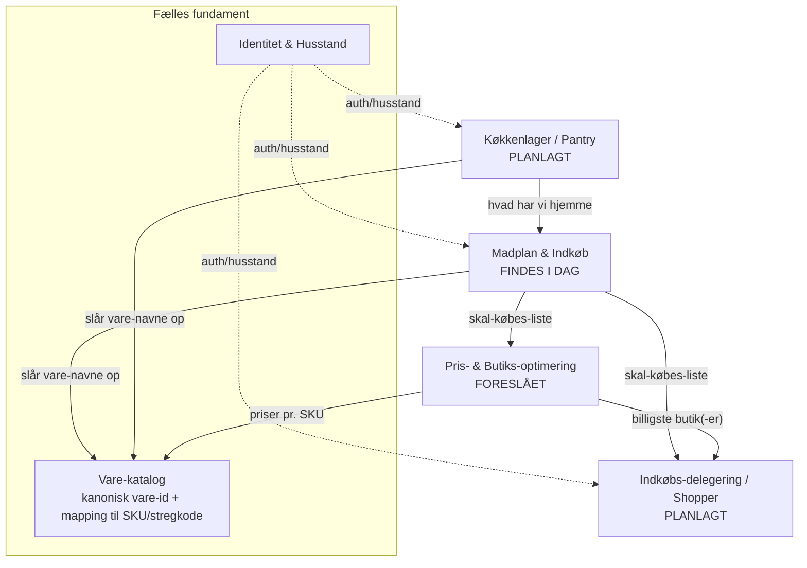

# Husholdnings-økosystemet — vision, systemer og ansvarsområder

> **Formål med dette dokument:** Give mennesker *og AI-agenter* et fælles overblik over det
> økosystem af samarbejdende apps vi bygger omkring "hvad skal vi spise, og hvad skal vi købe".
> Hvert system er beskrevet med sin **mission**, sit **ansvarsområde** (hvad det ejer / IKKE ejer),
> sine **nøgledata** og hvordan det **integrerer** med de andre. En agent der får dette dokument
> skal kunne forstå konteksten og arbejde i ét system uden at bryde de andre.

Sidst opdateret: 2026-07-05.

---

## 1. Vision

Én sammenhængende oplevelse for en husstand:

1. **Planlæg** ugens måltider (vælg retter). → *Madplan & Indkøb (findes i dag)*
2. **Ved hvad du har hjemme** (køkkenlager). → *Køkkenlager (planlagt)*
3. **Køb kun det du mangler** — listen trækker automatisk det fra, du allerede har. → *afstemning*
4. **Send/deleger indkøbet** til en anden (partner eller "indkøber"). → *Indkøbs-delegering (planlagt)*
5. **Køb det billigst** — find ud af hvilken butik (eller kombination) der er billigst. → *Pris-optimering (foreslået)*

Alt er **husstands-baseret**: en husstand deler ét login og sine data; husstande er isolerede fra hinanden.

---

## 2. Bærende designprincipper (gælder ALLE systemer)

1. **Husstand som tenant.** Al brugerdata er scoped til en `HouseholdId`. Systemer må aldrig lække
   data på tværs af husstande. (I dag ejer Madplan-appen login; se §7 om at udskille en fælles identitet.)
2. **Kanonisk vare-identitet er limet.** Alt hænger på, at "Løg" er den *samme* vare i opskriften,
   i køkkenlageret og i prisdatabasen. Dette løses af et fælles **Vare-katalog** (§4.6). Uden det
   kan systemerne ikke tale sammen. **Dette er den vigtigste arkitektur-beslutning i økosystemet.**
3. **API-først, løs kobling.** Hvert system er sin egen deployerbare service med et REST-API og sit
   eget datalager. De integrerer via API'er (og senere events), ikke via delt database.
4. **Ét system = én kilde til sandhed.** Fx: køkkenlageret er *eneste* kilde til "hvad har vi hjemme".
   Madplan-appen spørger lageret; den gemmer ikke sin egen kopi.
5. **Enheder og mængder er et fælles sprog.** g/kg, ml/l, stk osv. med konvertering (g↔kg, ml↔l).
   Logikken findes allerede i Madplan-appen og bør genbruges/udstilles som delt kontrakt (§6).
6. **Privat og gratis-venligt.** Systemerne skal kunne køre på gratis niveauer (jf. nuværende: Render + Neon).

---

## 3. Systemoversigt

| System | Rolle | Status | Repo/URL |
|---|---|---|---|
| **Madplan & Indkøb** | Retter, ugeplan, aggregeret indkøbsliste | ✅ I drift | `PeterRebsdorfAU/IndkobApp` · indkobapp-web.onrender.com |
| **Køkkenlager (Pantry)** | Hvad har husstanden hjemme lige nu | 🟡 Planlagt | (nyt repo) |
| **Indkøbs-delegering (Shopper)** | Send/deleger listen; en anden handler | 🟡 Planlagt | (nyt repo) |
| **Pris- & Butiks-optimering** | Hvor er det billigst; hvilken butik | 🔵 Foreslået | (nyt repo) |
| **Vare-katalog** | Kanonisk vare-identitet + SKU/stregkode-mapping | 🔵 Foreslået (fælles) | (nyt repo) |
| **Identitet & Husstand** | Fælles login/husstand på tværs | 🔵 Foreslået (udskilles fra Madplan) | (nyt repo) |

---

## 4. Systemerne i detaljer

### 4.1 Madplan & Indkøb  *(findes i dag — se [`apps/meal-shopping/ARCHITECTURE.md`](../apps/meal-shopping/ARCHITECTURE.md))*
- **Mission:** Vælg ugens retter/varegrupper → få én samlet, kategori-sorteret indkøbsliste hvor
  overlappende ingredienser lægges sammen.
- **Ejer:** Opskrifter, varegrupper, ugeplaner, den genererede indkøbsliste og dens afkrydsning,
  samt (i dag) husstands-login. Ejer aggregerings- og enhedslogikken.
- **Ejer IKKE:** Hvad man har hjemme (køkkenlager), priser, eller selve indkøbs-udførelsen.
- **Nøgledata:** `Recipe`, `ItemGroup`, `Week*`, `ShoppingListCheck`, `Ingredient`, `Category`, `Household`.
- **Vigtigste integrationspunkter fremad:**
  - *Skal* kunne spørge **Køkkenlageret**: "af denne skal-liste, hvad har vi allerede?" → trække fra.
  - *Skal* kunne udstille sin **skal-købes-liste** (kanoniske vare-id + mængde + enhed) til Shopper/Pris.
  - *Bør* slå ingrediens-navne op i **Vare-kataloget** i stedet for sin egen `Ingredient`-tabel (migreres over tid).

### 4.2 Køkkenlager / Pantry  *(planlagt)*
- **Mission:** Være husstandens sandhed om "hvad har vi hjemme lige nu", nemt at holde ajour.
- **Ejer:** Lagerbeholdning pr. vare (mængde + enhed), evt. udløbsdato, placering (køl/frys/skab),
  historik for forbrug. Metoder til at *tilføje* (køb hjem, stregkode-scan, kvittering) og *forbruge*
  (madlavning trækker fra, manuel justering).
- **Ejer IKKE:** Opskrifter eller indkøbsliste-generering (det er Madplan). Priser (det er Pris-systemet).
- **Nøgledata:** `PantryItem { HouseholdId, CanonicalItemId, Quantity, Unit, ExpiryDate?, Location? }`,
  `StockChange` (event-log: +køb / −forbrug / justering).
- **Smart ajourføring (idéer):**
  - **Stregkode-scan** ved indkøb hjem og ved forbrug (telefonkamera).
  - **Kvittering-scan** (OCR) → auto-tilføj købte varer.
  - **Auto-fratræk** når en uges retter markeres "lavet" i Madplan (kræver kobling mellem opskrift-mængder og lager).
  - **"Løber tør"-forudsigelse** ud fra typisk forbrug.
- **Integration:** Udstiller `GET /pantry/on-hand?items=[canonicalIds]` → mængder, som Madplan bruger til afstemning.

### 4.3 Afstemning: "køb kontra haves"  *(logik — ikke nødvendigvis eget system)*
- **Problem:** Indkøbslisten siger "500 g smør"; vi har "200 g" hjemme → køb kun 300 g.
- **Anbefaling:** Læg netto-beregningen i **Madplan-appen**, fordi den allerede bygger listen og ejer
  enheds-/aggregerings-logikken. Flow:
  1. Madplan aggregerer *behov* pr. kanonisk vare (som i dag).
  2. Madplan kalder Pantry for *on-hand* pr. samme vare.
  3. `at_buy = max(0, behov − on-hand)` efter enheds-konvertering; uforenelige enheder vises hver for sig (som i dag).
  4. Resultatet er "skal-købes-listen".
- **Kræver:** Kanonisk vare-id (så behov og lager matcher) + fælles enheds-konvertering.

### 4.4 Indkøbs-delegering / Shopper  *(planlagt)*
- **Mission:** Sende "skal-købes-listen" til nogen, der så ved præcis hvad der skal handles, og kan
  krydse af efterhånden — synkront tilbage til husstanden.
- **Ejer:** Delings-links/tokens, fulfilment-status pr. linje (åben/købt/ikke fundet/erstattet),
  notifikationer, og evt. profiler for eksterne "indkøbere".
- **Ejer IKKE:** Hvordan listen opstår (Madplan), eller lagerets indhold (Pantry).
- **Nøgledata:** `SharedList { Token, HouseholdId, Lines[], ExpiresAt }`, `LineStatus`.
- **Varianter:**
  - **Let:** Del et read-only/afkrydsnings-link (ingen konto for modtageren).
  - **Fuld:** Rigtig "shopper"-rolle med app, kvittering, evt. betaling/afregning.
- **Feedback-loop:** Når en linje markeres "købt", kan det (valgfrit) tilføje varen til **Køkkenlageret**.

### 4.5 Pris- & Butiks-optimering  *(foreslået)*
- **Mission:** Ud fra skal-købes-listen: find den **billigste** måde at handle på — hvilken butik,
  eller kombination af butikker, og hvad det koster.
- **Ejer:** Butikker, priser pr. **SKU** pr. butik (med tidsstempel/tilbud), og optimerings-algoritmen.
- **Ejer IKKE:** Listen selv eller vare-identiteten (bruger Vare-katalogets mapping vare→SKU pr. butik).
- **Nøgledata:** `Store`, `StorePrice { StoreId, Sku, Price, ValidFrom/To }`, `OptimizationResult`.
- **Kerne-beslutninger:**
  - **Enkelt-butik vs. multi-butik:** billigst samlet kan kræve to butikker — vej besparelse op mod
    ekstra tur/tid (parameter: "max antal butikker", "værdi af min tid").
  - **Datakilde er den svære del (flag tidligt):** priser kan komme fra (a) manuel indtastning,
    (b) offentlige/officielle pris-API'er hvor de findes, (c) tilbudsaviser/loyalitets-API'er,
    (d) scraping — sidstnævnte har **juridiske/ToS-forbehold** og bør undgås/afklares.
- **Output:** "Handl alt i Netto: 247 kr" eller "Netto (218 kr) + Rema (34 kr) sparer 22 kr".

### 4.6 Vare-katalog  *(foreslået — fælles fundament)*
- **Mission:** Give én kanonisk identitet pr. vare, som alle systemer refererer, plus mapping til
  butiks-SKU'er og stregkoder.
- **Ejer:** `CanonicalItem { Id, Name, Category, DefaultUnit, Synonyms[] }`,
  `ItemMapping { CanonicalItemId, Barcode?, StoreId?, Sku? }`.
- **Hvorfor:** Madplans normaliserede `Ingredient` (trimmet + lowercased matching) er en *lokal*
  version af dette. Når flere systemer skal enes om "samme vare", skal identiteten være fælles.
- **Migreringssti:** Start med at eksportere Madplans `Ingredient`-liste som kanoniske varer;
  lad de øvrige systemer referere dem; over tid bliver kataloget kilden Madplan slår op i.

### 4.7 Identitet & Husstand  *(foreslået — udskilles fra Madplan)*
- **Mission:** Ét login pr. husstand, der virker på tværs af *alle* systemer (SSO).
- **I dag:** Madplan-appen ejer `Household`, login (JWT) og admin-oprettelse. Det virker for ét system.
- **Fremad:** Udskil til en lille **identitets-service** der udsteder JWT med `householdId`, som de
  andre systemer *validerer* (samme signeringsnøgle / JWKS). Så deler man login på tværs.
- **Beslutning at tage:** Byg selv (som nu) vs. brug en gratis identitets-udbyder. For privat brug er
  "byg selv, del JWT-nøgle" enklest at starte med.

---

## 5. Foreslåede yderligere systemer / features (idébank)

| Idé | Kort beskrivelse | Kobler til |
|---|---|---|
| **Kvittering-scan** | OCR af kvittering → auto-opdater køkkenlager + faktiske priser | Pantry, Pris |
| **Stregkode-scan** | Scan vare → identificér via Vare-katalog, tilføj/forbrug | Pantry, Katalog |
| **Udløb & madspild** | Advar om varer der udløber; foreslå retter der bruger dem | Pantry → Madplan |
| **"Brug op"-forslag** | Foreslå ugens retter ud fra hvad der er hjemme/skal bruges | Pantry → Madplan |
| **Ernæring & kost** | Kalorier/makroer/allergener pr. ret og uge | Madplan, Katalog |
| **Opskrift-import** | Hent opskrift fra en URL → strukturér ingredienser | Madplan, Katalog |
| **Auto-genbestilling** | Basisvarer (mælk, kaffe) sættes på listen automatisk når lager er lavt | Pantry → Madplan |
| **Tilbud/loyalitet** | Træk personlige tilbud ind i pris-optimeringen | Pris |
| **Måltids-historik & yndlings** | Statistik, "det plejer vi", hurtigt genvalg | Madplan |
| **Rute/levering** | Butiksåbningstider, afstand, eller kobling til levering | Pris, Shopper |

---

## 6. Tværgående kontrakter (skal holdes stabile)

- **Husstands-identitet:** JWT med claim `householdId`. Alle systemer scoper til den.
- **Kanonisk vare-id:** heltal/UUID fra Vare-kataloget. Al udveksling af varer bruger dette id
  (ikke fritekst-navne, undtagen ved oprettelse/opslag).
- **Mængde + enhed:** `{ quantity: decimal, unit: enum }`. Enheds-familier: masse (g,kg), volumen
  (ml,l), styk/øvrige. Konvertering g↔kg og ml↔l; uforenelige enheder holdes adskilt. (Kanonisk
  reference-implementering findes i Madplans `UnitMath`.)
- **Liste-linje (udveksles mellem Madplan → Shopper/Pris):**
  `{ canonicalItemId, name, quantity, unit, category?, note? }`.
- **API-stil:** REST/JSON, husstands-scoping via JWT, fejl som HTTP-status + problem-details.

---

## 7. Faseinddelt køreplan (forslag)

- **Fase 1 (nu):** Madplan & Indkøb i drift med login pr. husstand. ✅
- **Fase 2:** Køkkenlager (Pantry) som selvstændig service + afstemning "køb kontra haves" i Madplan.
  Kræver første version af **kanonisk vare-id** (kan starte som en delt tabel/kontrakt).
- **Fase 3:** Indkøbs-delegering (start med simpelt delings-link + afkrydsning).
- **Fase 4:** Udskil fælles **Identitet** (SSO) + modn **Vare-kataloget**.
- **Fase 5:** Pris- & Butiks-optimering (afhænger af en realistisk prisdatakilde — afklares først).

---

## 8. Åbne beslutninger at bekræfte

1. **Topologi:** Ét repo pr. system (anbefalet, løs kobling) vs. mono-repo? *(Antaget: ét repo pr. system.)*
2. **Vare-identitet:** Hvornår indfører vi det fælles Vare-katalog? Det er en forudsætning for
   Pantry-afstemning og Pris — jo før en simpel udgave, jo bedre.
3. **Identitet:** Beholde login i Madplan indtil videre, eller udskille SSO allerede i Fase 2?
4. **Pris-data:** Findes der en lovlig/realistisk kilde til butikspriser i DK? Dette afgør om
   Pris-systemet er realistisk på kort sigt.
5. **Hosting:** Fortsætte gratis-stakken (Render + Neon) pr. system?

---

## 9. Ordliste

- **Husstand (Household):** Tenant. Ét delt login, isolerede data.
- **Kanonisk vare (Canonical item):** Den fælles identitet for en vare på tværs af systemer.
- **SKU:** En konkret butiks-varenummer (fx "Netto Gul løg 1 kg").
- **Behov vs. skal-købes:** *Behov* = hvad retterne kræver. *Skal-købes* = behov minus hvad der er hjemme.
- **Aggregering:** Sammenlægning af ens varer/enheder til én linje (Madplans kernelogik).
